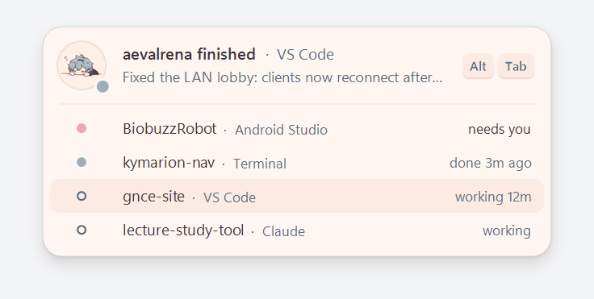

# Aevalsistant

A Windows tray app for people who run several AI coding agents at once. It keeps the PC awake while
any agent is working, and when one finishes or needs you, a card drops from the top of the screen
saying which one. Click the card, or press Alt+Tab while it is showing, to jump to that window.

## Download

**[Download Aevalsistant.exe](https://github.com/aevalmere/aevalsistant/releases/latest/download/Aevalsistant.exe)**
(Windows 10 or 11, about 170 KB). Other versions are on the [releases page](https://github.com/aevalmere/aevalsistant/releases).

Run it from wherever it downloaded. It copies itself to `%LOCALAPPDATA%\Aevalsistant`, starts from
there, and shows a card once it is in the tray. There is no installer and no admin prompt. Don't
use "Run as administrator": agents running normally can't reach an elevated copy, so it refuses
to start that way.

The exe is not code-signed yet, so the first run may show "Windows protected your PC". Choose
**More info**, then **Run anyway**. Each release lists the file's SHA-256 if you want to check it.

## Features

- A Windows power request keeps the PC from sleeping until the last agent stops, then lets go.
  Optionally it keeps the screen on too, or keeps working with the laptop lid closed.
- The card's top row is the session that just changed. Under it is every other session with its
  state: needs you, done 3m ago, working 12m, 2 subagents running.
- Clicking a row focuses the terminal, editor, or app that session runs in. Alt+Tab while the card
  is showing jumps to the top one.
- A Claude Code session stays busy while its subagents run, including background subagents that
  keep going after the main turn ends.
- The card never takes keyboard focus, is hidden from screenshots and screen sharing, and only
  counts down while you are at the keyboard.
- It updates itself from this repository's releases, and waits until no agent is working before
  it restarts.

## What it tracks

| Agent | How | Where it is configured | One-time step |
|---|---|---|---|
| Claude Code (terminal, VS Code, JetBrains, Claude desktop Code tab) | Hooks | `~/.claude/settings.json` | Restart open sessions once |
| Codex CLI and the Codex IDE extension | Hooks | `~/.codex/hooks.json` | In Codex, run `/hooks` once to trust them |
| Gemini CLI | Hooks | `~/.gemini/settings.json` | Restart open sessions once |
| GitHub Copilot CLI | Hooks | `~/.copilot/hooks/aevalsistant.json` | Restart open sessions once |
| Cursor (agent in the editor) | Hooks | `~/.cursor/hooks.json` | None |
| Windsurf (Cascade) | Hooks | `~/.codeium/windsurf/hooks.json` | None |
| OpenCode | Plugin | `~/.config/opencode/plugins/aevalsistant.js` | Restart OpenCode once |
| Claude desktop chat, ChatGPT desktop | Reads the app's Stop button through Windows accessibility | Nothing to configure | None |

Hooks are only added for agents whose config folder exists on this PC. Agents installed later are
picked up within 10 minutes. Every file is backed up once as `<name>.aevalsistant.bak` before the
first change, and other hooks in it are left alone.

Rows and notifications name the project folder, the agent when it is not Claude Code, and the app it
runs in: "rover needs you · Codex · Terminal", "site finished · Gemini CLI".

Chat apps have no hooks. When you switch away from Claude or ChatGPT while a reply is being written,
the app sees the reply's Stop button. It then checks every few seconds until the button is gone and
shows "Chat finished · Claude". Nothing is read while you are not waiting on a reply. If the reply
finishes while that app is in front, no notification is shown. Turn this off with "Watch Claude and
ChatGPT chats" in the tray menu.

Not tracked:

- Cloud sessions of any agent, which run on the provider's servers.
- Chats in a browser tab.
- Background shell commands, which have no completion hook.
- Aider, which only has a "waiting for input" command and no start signal.
- Cline, whose hook format could not be confirmed.

## Tray menu

Left- or right-click the tray icon. The icon's eyes are open while it is keeping the PC awake.

| Item | Default | What it does |
|---|---|---|
| Stay awake with the lid closed | Off | Sets the power plan's lid action to "Do nothing" while agents work, and puts it back after |
| Keep the screen on while agents work | Off | Also stops the display from turning off |
| Start with Windows | On | Starts the tray app when you sign in |
| Connect coding agents | On | Adds or removes the hooks in the table above |
| Watch Claude and ChatGPT chats | On | Notices replies finishing in the desktop chat apps |
| Update automatically | On | Checks for a new release two minutes after start and every six hours |
| Check for updates | | Checks right away |
| Show a test notification | | Shows a card for the most recent session |
| Remove from this PC | | Undoes everything listed below and deletes the app |

The menu header shows the running version.

## What it changes on your PC

- Copies itself to `%LOCALAPPDATA%\Aevalsistant\`, and keeps its settings there in `settings.ini`.
- Adds hook entries to the files in the table above, for agents that are installed.
- Adds a `HKCU\Software\Microsoft\Windows\CurrentVersion\Run` entry when "Start with Windows" is on.
- While agents work: a power request named "Aevalsistant: AI agents are running" (check with
  `powercfg /requests`). With "Stay awake with the lid closed" on, the lid action of the active power
  plan is set to "Do nothing" and restored when the last agent stops, or on the next start after a
  crash.

"Remove from this PC" in the tray menu undoes all of it, including the hooks in every agent's files.

The only network traffic is the update check: a request to `api.github.com` for this repository's
latest release, and the download of a newer exe when there is one. Nothing about your sessions,
projects, or prompts leaves the PC.

## Updates

A newer release is downloaded to `%LOCALAPPDATA%\Aevalsistant\update\` and checked against the
SHA-256 that GitHub publishes for the file. Its version is read from the file itself. It is installed
the next time no agent is working, because restarting forgets which sessions are busy. After the
restart, a card says which version is now running.

To update by hand, run a newer exe. It replaces the installed copy the same way.

Version 1.1.0 and earlier have no updater. If the tray menu shows no "Check for updates" item,
download the latest exe once and run it.

## Known limits

- Focus lands on the window, not on a specific terminal tab inside VS Code or Windows Terminal, and
  not on a specific chat inside the desktop app.
- Sessions that were already open when the hooks were installed or changed must be restarted once.
- The non-Claude agents were wired from each tool's hook documentation. If one of them does not show
  up, please [open an issue](https://github.com/aevalmere/aevalsistant/issues/new/choose) with the
  agent's version.

## Build from source

Needs the [.NET SDK](https://dotnet.microsoft.com/download) 8 or later. The app itself targets .NET
Framework 4.8, which ships with Windows 10 and 11, so the exe has no runtime to install.

    dotnet build -c Release
    dotnet build -c Release tests
    tests\bin\Release\net48\Aevalsistant.Tests.exe preview

The exe lands in `bin\Release\net48\Aevalsistant.exe`. The test run prints a pass count and writes
renders of the card to `preview\`. [docs/ARCHITECTURE.md](docs/ARCHITECTURE.md) explains how the
pieces fit, and [docs/DESIGN.md](docs/DESIGN.md) holds the visual rules.

## Releasing

1. Set `<Version>` in `Aevalsistant.csproj` to the new version.
2. Add a `## [x.y.z] - YYYY-MM-DD` section to the top of `CHANGELOG.md`.
3. Commit, then tag and push:

       git tag v1.3.0
       git push origin main v1.3.0

The [build workflow](.github/workflows/build.yml) builds and tests on Windows, refuses the tag if it
does not match `<Version>` or the changelog, and publishes a release with `Aevalsistant.exe` as its
only file. The changelog section becomes the release notes. Version numbers must go up: installed
copies only take a release newer than themselves, so a bad release is rolled back by publishing the
old code under a higher version.

## License

[MIT](LICENSE)
